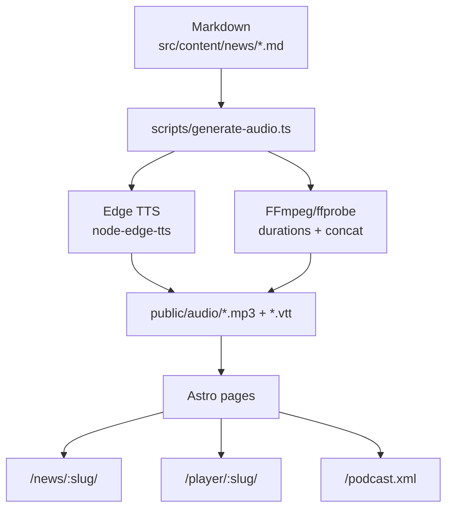
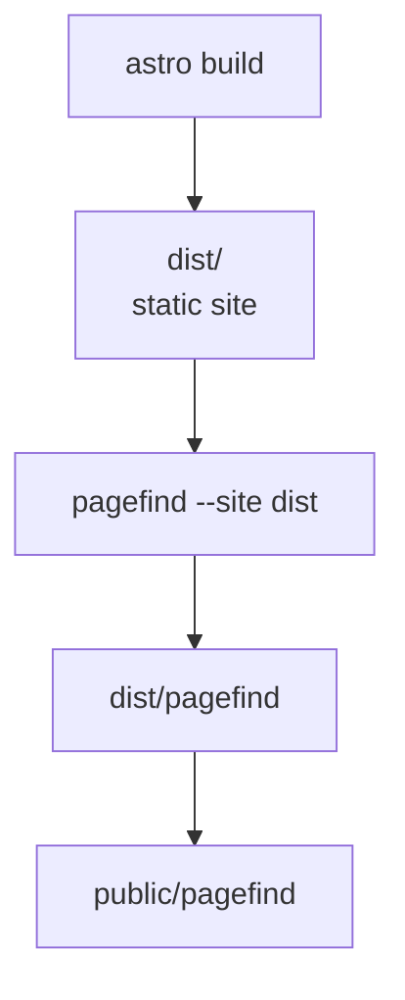

# HNPaper News

Welcome to the **HNPaper News** repository, an automated news archive from [HNPaper](https://hnpaper-labs.gaidot.net).

## ✨ Features

- **Daily Summaries**: Automated archives of HNPaper news.
- **Audio Player (TTS)**: Integrated text-to-speech functionality to listen to articles. MP3 audio files are automatically generated for each article by the `generate-audio.ts` script, which are then used by the TTS player and for Google Cast.
- **Word-Level Highlighting**: VTT subtitles enable per-word highlighting during audio playback.
- **Google Cast Support**: Stream article audio to Google Cast devices (e.g., Google Home, Chromecast) with subtitle support.
- **Podcast Feed**: RSS feed that exposes every article with an MP3 enclosure.
- **PWA Support**: Installable as a native app on mobile and desktop devices with offline caching capabilities.
- **Share Section**: Click on the link icon next to any paragraph to copy a direct link to that specific section.
- **Full-Page Player**: Dedicated `/player/:slug` route with an audio visualizer.
- **Archives & Pagination**: `/news` paginated archive (12 items per page).
- **Newspaper Design**: A clean, serif-focused aesthetic inspired by classic print media.
- **Global Search (Pagefind)**: Integrated client-side search using Pagefind, enabling users to search articles with dynamic results, "Load More" pagination, and custom styling. The search index is automatically built and copied during the build process.

## 🚀 Technologies

- **Framework**: [Astro](https://astro.build) v5
- **Styles**: [Tailwind CSS](https://tailwindcss.com) v4
- **PWA**: Vite PWA
- **Linting/Formatting**: [Biome](https://biomejs.dev)
- **Hosting**: GitHub Pages

## 📂 Project Structure

```text
/
├── .github/workflows # GitHub Actions for deployment
├── public/           # Static files (favicon, CNAME, pwa icons, **generated audio files** in `public/audio` as .mp3/.vtt)
├── src/
│   ├── components/   # UI Components (TTSPlayer, etc.)
│   ├── content/      # Content collections
│   │   └── news/     # News Markdown files (YYYY-MM-DD-HHMM.md)
│   ├── layouts/      # Layouts (Layout.astro)
│   ├── pages/        # Routes (index, pagination, detail pages)
│   ├── scripts/      # Client-side scripts (TTS, Navigation)
│   ├── utils/        # Shared helpers (dates, reading time, audio paths)
│   └── styles/       # Global CSS
├── astro.config.mjs  # Astro configuration
└── package.json      # Dependencies and scripts
```

## 🧭 Diagrams (Overview)

These diagrams give a high-level view of how content becomes audio and ends up on the site, plus the build steps with search indexing.

### Content, audio, and site pipeline



### Build flow with search indexing



## 🛠️ Installation and Local Development

Prerequisites:

- Bun installed (https://bun.sh).
- `ffmpeg` + `ffprobe` available in PATH (audio generation uses them).

1.  **Install dependencies**

    ```bash
    bun install
    ```

2.  **Start the development server**

    ```bash
    bun run dev
    ```

    The site will be available at `http://localhost:4321`.

3.  **Generate Audio Files**

    The project automatically generates `.mp3` audio files and `.vtt` subtitles for each article, which are used by the TTS player and Google Cast. (JSON timestamps are generated transiently by Edge TTS and removed after conversion.)
    This step requires an internet connection because `node-edge-tts` uses Microsoft Edge TTS voices.

    ```bash
    bun run scripts/generate-audio.ts
    ```

    To force regeneration of all audio files (even if they already exist):

    ```bash
    bun run scripts/generate-audio.ts --force
    ```

4.  **Linting & Formatting**

    The project uses Biome for linting and formatting.

    ```bash
    # Lint files
    bun run lint

    # Format files
    bun run format

    # Check and fix issues
    bun run check:fix
    ```

5.  **Preview the production build**

    ```bash
    bun run preview
    ```

6.  **Build the production site**

    ```bash
    bun run build
    ```

    This runs `astro build`, generates the Pagefind index, then copies it to `public/pagefind/` for static hosting.

## 📦 Deployment

Deployment is automated via **GitHub Actions**.

- On every push to the `main` branch, the workflow `.github/workflows/deploy.yml` builds the site and deploys it to the GitHub Pages environment.
- The workflow `.github/workflows/generate-audio.yml` automatically generates and commits audio files for new or updated articles, then triggers a new deploy.

## 🧰 Utils & Scripts

### `scripts/fix-news-links.py`

This Python script automatically corrects or updates the "Discussion HN" and "Article source" links in the Markdown articles (`src/content/news/*.md`) based on the CSV file (which should be located at the root of the project). It parses the content of each article individually to reliably match and inject the correct URLs.

**Usage:**

```bash
python3 scripts/fix-news-links.py
```

### `src/utils/`

- `audio.ts`
  - `getAudioPath(slug)` → absolute path to `public/audio/{slug}.mp3`
  - `getAudioUrl(site, slug)` → absolute URL to `audio/{slug}.mp3` using `context.site`
  - `hasLocalAudio(slug)` → `true` if the MP3 exists on disk

- `formatDate.ts`
  - `formatFrenchDate(date)` → `EEEE d MMMM yyyy à HH:mm`
  - `formatFrenchDateShort(date)` → `d MMMM yyyy`
  - `formatFrenchDateLong(date)` → `EEEE d MMMM yyyy`

- `news.ts`
  - `sortNewsByDateDesc(entries)` → newest → oldest (non‑mutating)
  - `getLatestNews(entries)` → returns the newest entry

- `readingTime.ts`
  - `getReadingTimeMinutes(text, wpm = 200)` → reading time in minutes
  - `formatReadingTimeMinutes(minutes)` → `X h Y min` or `Z min`

### `src/scripts/client/`

- `bento.ts`
  - `initBentoSections()` → wraps `.bento-grid` content into `.bento-section` blocks split by `<hr>`, emits `bento-wrapped`

- `ArticleNavigation.ts`
  - `constructor()` → finds UI elements and initializes navigation
  - `init()` → scan sections + bind events + scroll spy + hash handling
  - `scanSections()` → builds section list (bento or `<hr>` based)
  - `createAnchor(element, id, index)` → adds section number + copy link button
  - `bindEvents()` → prev/next/top/play, keyboard shortcuts, speed + state listeners
  - `navigate(dir)` → move to next/prev section (and play if active)
  - `setupScrollSpy()` → updates active section on scroll
  - `scrollToSection(index)` → smooth scroll to section
  - `handleInitialHash()` → jump to `#section-N` on load

- `TTSController.ts`
  - `constructor(options)` → wires UI, audio, and state
  - `init()` → events + cast init + content prep + remaining time
  - VTT/word alignment:
    - `loadVTT()`, `parseVTT(text)`, `normalizeWord(word)`, `buildCueMappingByText()`, `findCueAtTime(time)`
  - Audio + remaining time:
    - `bindAudioEvents()`, `getEffectiveRate()`, `formatRemainingTime(seconds)`
    - `renderRemainingTime(seconds)`, `resetRemainingTime()`, `updateRemainingTime()`
    - `updateRemainingTimeFromAudio()`, `updateRemainingTimeFromText()`
  - Casting:
    - `initializeCast()`, `loadRemoteMedia()`
  - Controls:
    - `bindEvents()`, `toggle()`, `play()`, `pause()`, `resume()`, `stop()`
    - `playFromElement(element)`
  - Content prep + highlighting:
    - `prepareContent()`, `wrapWords()`, `buildWordMap()`, `segmentSentences()`
    - `speakSentence()`, `highlightWord(index)`, `highlightElements(elements)`, `clearHighlight()`
  - Speed + session:
    - `updateSpeed()`, `setupMediaSession()`
  - Wake lock + state:
    - `requestWakeLock()`, `releaseWakeLock()`, `updateState(state)`

## 🧰 Release

Simple tag-based release script:

```bash
./scripts/release.sh X.Y.Z
```

## 📄 Data Format

News items are stored in `src/content/news/` as Markdown files.
**Filename convention**: `YYYY-MM-DD-HHMM.md`

### Frontmatter Schema

Each file must begin with the following YAML frontmatter:

```yaml
---
title: "Actualités du 27/01/2026 à 14:00"
date: 2026-01-27T14:00:00+01:00
author: HNPaper Bot
tags: [news]
---
```

Optional fields:

- `tags` (array of strings)
- `layout` (string)

The filename (without `.md`) becomes the slug used for routes and audio files (e.g. `2026-01-27-1400` → `/news/2026-01-27-1400/` and `public/audio/2026-01-27-1400.mp3`).
