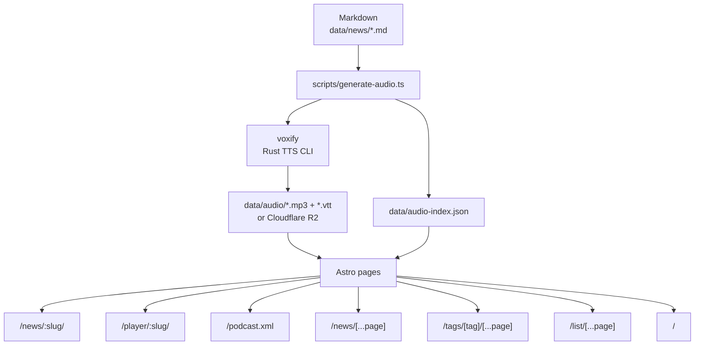
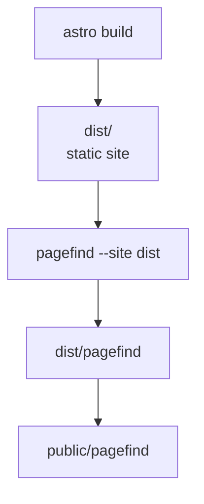
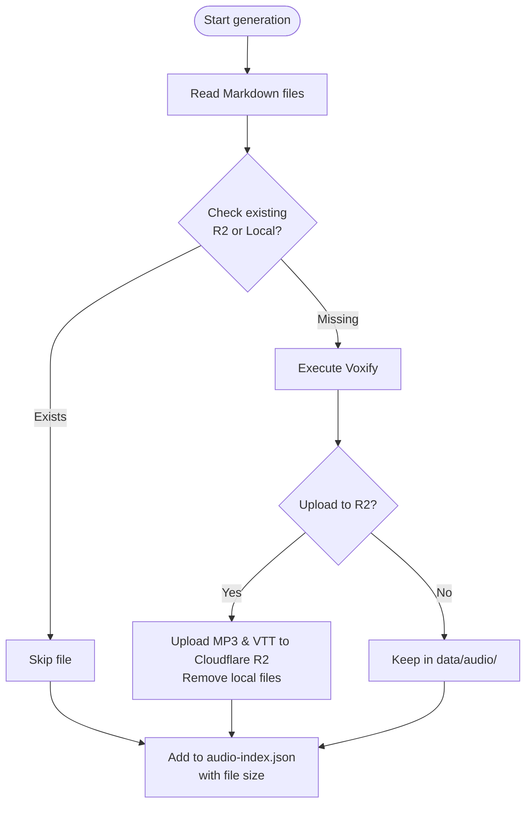
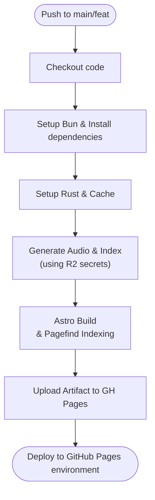

# HNPaper News

Welcome to the **HNPaper News** repository, an automated news archive from [HNPaper](https://hnpaper-labs.gaidot.net).

## ✨ Features

- **Daily Summaries**: Automated archives of HNPaper news.
- **Audio Player (TTS)**: Integrated text-to-speech functionality to listen to articles. MP3 audio files are automatically generated for each article by the Rust `voxify` CLI, which are then used by the TTS player and for Google Cast.
- **Word-Level Highlighting**: VTT subtitles enable per-word highlighting during audio playback.
- **Google Cast Support**: Stream article audio to Google Cast devices (e.g., Google Home, Chromecast) with subtitle support.
- **Podcast Feed**: RSS feed that exposes every article with an MP3 enclosure.
- **PWA Support**: Installable as a native app on mobile and desktop devices with offline caching capabilities and full Multi-Page Application (MPA) routing support.
- **Share Section**: Click on the link icon next to any paragraph to copy a direct link to that specific section.
- **Full-Page Player**: Dedicated `/player/:slug` route with an audio visualizer.
- **Archives & Pagination**: `/news` paginated archive (12 items per page) and a compact `/list` view (30 items per page).
- **Tags & Navigation**: Support for reading and navigating articles by categories using a dedicated `/tags` route and tag clouds.
- **Newspaper Design**: A clean, serif-focused aesthetic inspired by classic print media, utilizing a dynamic Masonry layout for article sections.
- **Global Search (Pagefind)**: Integrated client-side search using Pagefind, enabling users to search articles with dynamic results, "Load More" pagination, and custom styling. The search index is automatically built and copied during the build process.

## 🚀 Technologies

- **Framework**: [Astro](https://astro.build) v5
- **Styles**: [Tailwind CSS](https://tailwindcss.com) v4
- **Package Manager**: [Bun](https://bun.sh)
- **PWA**: Vite PWA
- **Search**: [Pagefind](https://pagefind.app)
- **Deployment/Serving**: Docker (Nginx with Brotli) & GitHub Pages
- **Linting/Formatting**: [Biome](https://biomejs.dev)

## 📂 Project Structure

```text
/
├── .github/workflows # GitHub Actions for deployment and audio generation
├── data/             # Content and generated data
│   ├── audio/        # Generated audio files (mp3, vtt)
│   ├── news/         # News Markdown files (YYYY-MM-DD-HHMM.md)
│   └── audio-index.json # Generated JSON index
├── public/           # Static files (favicon, CNAME, pwa icons)
├── scripts/          # Automation scripts (audio generation, release)
├── src/
│   ├── components/   # UI Components (TTSPlayer, Search, etc.)
│   ├── content/      # Content collections config and symlinks
│   ├── layouts/      # Layouts (Layout.astro)
│   ├── pages/        # Routes (index, pagination, detail pages)
│   ├── scripts/      # Client-side scripts (TTS, Navigation)
│   ├── styles/       # Global CSS
│   └── utils/        # Shared helpers (dates, reading time, audio paths)
├── voxify/           # Rust backend for high-performance audio generation
├── astro.config.mjs  # Astro configuration
├── makefile          # Shortcuts for build and deployment
├── nginx.conf        # Optimized Nginx configuration
├── Dockerfile        # Container configuration for production serving
└── package.json      # Dependencies and scripts
```

## 🧭 Diagrams (Overview)

### Content, audio, and site pipeline



### Build flow with search indexing



### Audio Generation Flow (`generate-audio.ts`)



### Automated Deployment Flow (GitHub Actions)



## 🛠️ Installation and Local Development

Prerequisites:

- [Bun](https://bun.sh) installed.
- [Rust](https://www.rust-lang.org) (Cargo) available in PATH (audio generation uses `voxify`).

1.  **Install dependencies**

    ```bash
    make install
    ```

2.  **Start the development server**

    ```bash
    make dev
    ```

    The site will be available at `http://localhost:4321`.

3.  **Preview the production build locally**

    To test the optimized production build (including Pagefind search, which requires a build to generate the index):

    ```bash
    make build-code
    make preview
    ```

4.  **Generate Audio Files**

    The project automatically generates `.mp3` audio files and `.vtt` subtitles for each article. This step requires an internet connection because `voxify` uses Microsoft Edge TTS voices.

    **Cloudflare R2 Storage Integration:**
    To avoid excessive storage on GitHub and speed up generation times, audio files are synced to a Cloudflare R2 bucket. Set the following environment variables (or `.env` file locally):
    - `R2_ACCOUNT_ID`: Your Cloudflare account ID.
    - `R2_ACCESS_KEY_ID`: Your R2 API access key.
    - `R2_SECRET_ACCESS_KEY`: Your R2 API secret key.
    - `R2_BUCKET_NAME`: The name of your R2 bucket.
    - `PUBLIC_R2_URL`: The public domain of your R2 bucket (e.g., `https://pub-xxxxxx.r2.dev`).
    - `PUBLIC_POSTHOG_KEY`: Your PostHog project API key for client-side analytics.
    - `PUBLIC_POSTHOG_HOST`: Your PostHog ingestion host (e.g. `https://eu.i.posthog.com` or your self-hosted domain).

    If these credentials are provided, the script will fetch missing audio from R2, generate it if necessary, upload it, and then delete the local file. It will output an index file at `data/audio-index.json`. If credentials are omitted, it will fall back to saving files directly in the `data/audio/` directory.

    ```bash
    make generate-audio
    ```

    **Targeted Generation:**
    You can generate audio for specific articles by passing their paths or filenames as arguments:

    ```bash
    # For a specific file
    bun run scripts/generate-audio.ts data/news/2026-04-14-1351.md

    # For multiple files
    bun run scripts/generate-audio.ts data/news/file1.md data/news/file2.md
    ```

    To force regeneration of all audio files (even if they already exist):

    ```bash
    bun run scripts/generate-audio.ts --force
    ```

5.  **Linting & Formatting**

    The project uses Biome for linting and formatting.

    ```bash
    # Lint files
    make lint

    # Format files
    make format

    # Check and fix issues
    make check-fix
    ```

## 📊 Analytics

Client-side analytics are sent to PostHog only when both `PUBLIC_POSTHOG_KEY` and `PUBLIC_POSTHOG_HOST` are defined.

### Search events

- `search_performed`: Triggered after a Pagefind query completes. Properties: `query`, `results_count`.
- `search_result_clicked`: Triggered when a user clicks a search result. Properties: `query`, `result_index`, `visible_results`, `total_results`, `target_url`.
- `search_load_more_clicked`: Triggered when the user expands the visible search result list. Properties: `query`, `visible_results`, `total_results`.
- `search_cleared`: Triggered when the search field is cleared with the clear button. Properties: `query`, `results_count`.

### Audio and player events

- `tts_play_started`: Triggered when article playback starts. Properties: `slug`, `title`, `player_surface`, `playback_mode`.
- `tts_paused`: Triggered when playback is paused. Properties: `slug`, `title`, `player_surface`, plus `current_time_seconds` or `current_char_index` depending on playback mode.
- `tts_resumed`: Triggered when playback resumes. Properties: `slug`, `title`, `player_surface`, plus `current_time_seconds` or `current_char_index`.
- `tts_stopped`: Triggered when playback is stopped before completion. Properties: `slug`, `title`, `player_surface`.
- `tts_playback_completed`: Triggered when audio reaches the end. Properties: `slug`, `title`, `player_surface`, `duration_seconds`.
- `tts_speed_changed`: Triggered when playback speed changes. Properties: `slug`, `title`, `player_surface`, `playback_mode`, `speed`.
- `tts_seeked_from_text`: Triggered when playback jumps from a clicked word in the article. Properties: `slug`, `title`, `player_surface`, `selected_word`, plus `target_time_seconds` or `current_char_index`.
- `tts_open_full_player_clicked`: Triggered when the article player opens the dedicated `/player/:slug` page. Properties: `slug`, `title`, `source`.
- `tts_cast_requested`: Triggered when the cast action is requested. Properties: `slug`, `title`, `player_surface`.
- `tts_cast_connected`: Triggered after a cast session is connected. Properties: `slug`, `title`, `player_surface`.

### Shared analytics properties

- `slug`: Article identifier used in URLs.
- `title`: Article title.
- `player_surface`: Playback UI origin, either `article_player` or `full_player`.
- `playback_mode`: Active playback transport, either `audio`, `cast`, or `speech_synthesis`.

### Recommended dashboards

- Search usage: track `search_performed` over time, average `results_count`, and top `query` values.
- Search effectiveness: build a funnel from `search_performed` to `search_result_clicked` and segment by `query`.
- Audio engagement: compare `tts_play_started`, `tts_paused`, `tts_resumed`, `tts_stopped`, and `tts_playback_completed`.
- Playback completion by article: break down `tts_playback_completed` by `slug` and compare it to `tts_play_started`.
- Player surface adoption: split `tts_play_started` by `player_surface` to see whether users listen more from article pages or the dedicated player.
- Speed preferences: chart `tts_speed_changed` by `speed` to understand listening habits.
- Cast usage: monitor `tts_cast_requested` and `tts_cast_connected` as a simple cast conversion funnel.

### Dashboard definitions

#### Dashboard 1: Search

Name: `Search Performance`

Widgets to create:

- `Searches over time`
  - Event: `search_performed`
  - Display: line chart
  - Interval: daily
- `Top queries`
  - Event: `search_performed`
  - Breakdown: `query`
  - Display: bar chart
  - Limit: 20
- `Searches with zero results`
  - Event: `search_performed`
  - Filter: `results_count = 0`
  - Display: single value
- `Search result click-through`
  - Insight type: funnel
  - Step 1: `search_performed`
  - Step 2: `search_result_clicked`
  - Breakdown optional: `query`

#### Dashboard 2: Audio

Name: `Audio Engagement`

Widgets to create:

- `Starts vs completions`
  - Events: `tts_play_started`, `tts_playback_completed`
  - Display: line or bar
  - Interval: daily
- `Completion rate funnel`
  - Funnel:
    - Step 1: `tts_play_started`
    - Step 2: `tts_playback_completed`
  - Breakdown: `player_surface`
- `Pause / resume / stop`
  - Events: `tts_paused`, `tts_resumed`, `tts_stopped`
  - Display: stacked bar
- `Top listened articles`
  - Event: `tts_play_started`
  - Breakdown: `slug`
  - Display: bar chart

#### Dashboard 3: Player & Cast

Name: `Player Behavior`

Widgets to create:

- `Article player vs full player`
  - Event: `tts_play_started`
  - Breakdown: `player_surface`
  - Display: pie or bar
- `Playback mode usage`
  - Event: `tts_play_started`
  - Breakdown: `playback_mode`
  - Display: bar
- `Speed preferences`
  - Event: `tts_speed_changed`
  - Breakdown: `speed`
  - Display: bar
- `Cast conversion`
  - Funnel:
    - Step 1: `tts_cast_requested`
    - Step 2: `tts_cast_connected`

## 📦 Build & Deployment

### GitHub Pages (Automated)

Deployment is automated via **GitHub Actions**.

- On every push to the `main` branch, the workflow `.github/workflows/deploy.yml` runs.
- It compiles `voxify`, fetches missing audio from Cloudflare R2 (or generates it), builds the Astro site with Pagefind indexing, and deploys everything to the GitHub Pages environment.

### Docker / Podman & Nginx (Manual/Private)

The project includes a `Dockerfile` and an optimized `nginx.conf` for serving the static site with Brotli compression and proper security headers. It uses `podman` in the provided `makefile`.

1.  **Build the production image**
    This command will pull the latest code, build the Astro site, and build the container image using Podman.
    ```bash
    make build
    ```

2.  **Publish to a private registry**
    The makefile includes commands to tag and push the image to a private registry.
    ```bash
    # Publish and tag the image
    make publish

    # Push to the private registry
    make push
    ```

## 🧰 Components, Utils & Scripts

### `src/components/`

- `ArticleFloatingNav.astro`: A floating navigation bar for articles (next/prev section, speed control) that syncs with TTS playback.
- `AudioPlayer.astro`: A persistent audio player component for listening to articles.
- `Search.astro`: A client-side search interface powered by Pagefind with dynamic results and pagination.
- `TagCloud.astro` / `TagList.astro`: Components for displaying categorized tags associated with articles.
- `TTSPlayer.astro`: The primary UI controls for the Text-to-Speech functionality within articles.
- `VoiceVisualizer.astro`: An audio visualizer used on the dedicated player route (`/player/:slug`).

### `src/layouts/`

- `Layout.astro`: The primary layout wrapper for the website, including the common `<head>` metadata, navigation, PWA, and global search.
- `LayoutPlayer.astro`: A specialized layout used exclusively for the full-screen audio player route without the standard navigation elements.

### `scripts/generate-audio.ts`

This script acts as the orchestrator for generating MP3 audio files and VTT subtitles from the Markdown articles. The heavy lifting is delegated to the `voxify` Rust CLI. The complete flow is as follows:
1.  **Parse Markdown & Identify Changes**: Reads articles from `data/news/`, cleans the Markdown, and hashes the content to compare against `data/audio-index.json`.
2.  **Filter**: Skips generation if the hash hasn't changed and the audio files already exist locally or on Cloudflare R2.
3.  **Execute Voxify**: Compiles (if needed) and runs the `voxify` CLI. Voxify handles the complex tasks of text chunking, calling the Edge TTS API concurrently, concatenating segments, and generating `.vtt` subtitles directly in memory.
4.  **Cloud Storage (Optional)**: If Cloudflare R2 credentials are provided, the script uploads the `.mp3` and `.vtt` files generated by `voxify` to the bucket and removes them locally.
5.  **Index Update**: Updates `data/audio-index.json` with the final file sizes and content hashes.

### `scripts/release.sh`

Simple tag-based release script: `./scripts/release.sh X.Y.Z`

### `src/utils/`

- `audio.ts`: Helpers for audio paths and URLs.
- `formatDate.ts`: French date formatting utilities.
- `news.ts`: Sorting and retrieval logic for news entries.
- `readingTime.ts`: Reading time calculation.
- `slugify.ts`: String slugification utility.

### `src/scripts/client/`

- `ArticleNavigation.ts`: Handles sectioning, scroll spy, and keyboard shortcuts.
- `TTSController.ts`: Manages audio playback, VTT syncing, and Google Cast integration.
- `masonry.ts`: Client-side masonry layout functionality.

## 📄 Data Format

### News Content

News items are stored in `data/news/` as Markdown files using the `YYYY-MM-DD-HHMM.md` naming convention.

**Frontmatter Schema:**

```yaml
---
title: "Actualités du 27/01/2026 à 14:00"
date: 2026-01-27T14:00:00+01:00
author: HNPaper Bot
tags: [news]
---
```

### Audio Index (`data/audio-index.json`)

When the audio generation script (`scripts/generate-audio.ts`) runs, it produces an index mapping each article's filename (without the `.md` extension) to metadata about its generated audio file. It stores two key pieces of information:

1.  **`size` (in bytes)**: Utilized by the Astro pages to efficiently determine if an audio version of an article is available and to expose its file size for the RSS podcast feed (`/podcast.xml`).
2.  **`hash`**: An MD5 hash of the *cleaned* text content. The orchestration script uses this hash to detect whether the source text of an article has been modified since the last run. If the hash hasn't changed, the script skips the costly TTS generation process, drastically speeding up CI execution.

```json
{
  "2026-01-27-1400": {
    "size": 420512,
    "hash": "e6a0cb5d3a52e0081079d856d333dc1b"
  }
}
```
